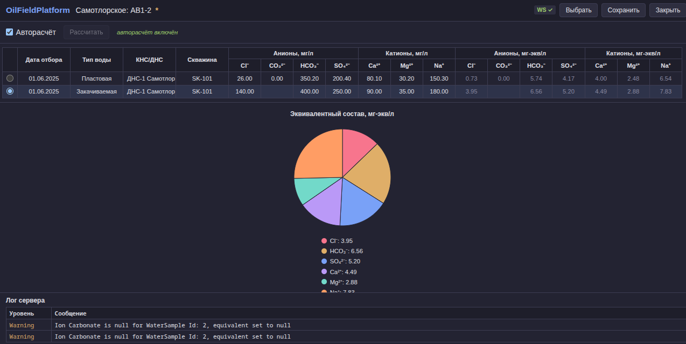

# OilFieldPlatform

**Пример многослойной платформы для работы с предметными базами данных** с демонстрационным модулем расчёта ионного состава пластовых вод.

OilFieldPlatform состоит из двух частей:
- **OilFieldPlatform** — базовая платформа: слой доменных сущностей, инфраструктура доступа к данным (NHibernate, PostgreSQL/SQLite), репозитории с CQRS-light, аудит, AutoMapper-маппинг.
- **OilFieldPlatform.Calculation** — пример модуля на этой платформе: полный стек от серверной бизнес-логики до Vue.js-фронтенда с WebSocket-транспортом и Redis-сессиями.

---

## Возможности

- **Реактивные модели** — ионные концентрации пробы воды через `BehaviorSubject<double?>`, проект управляется `DynamicData.SourceList`. Любое изменение иона автоматически запускает пересчёт эквивалентов.
- **WebSocket API с JSON-схемами** — типизированные запросы/ответы сервера через `[JsonDerivedType(TypeDiscriminatorPropertyName = "type")]`. Каждый тип сообщения — отдельный C#-класс на бэкенде и TypeScript-интерфейс на фронтенде.
- **Персистентные сессии** — состояние несохранённого проекта автоматически сохраняется в Redis (при каждом изменении, раз в минуту и при закрытии). При перезагрузке страницы фронтенд передаёт `sessionId` — проект восстанавливается.
- **Расчёт эквивалентов** — `WaterSampleEquivalentCalculator` пересчитывает миллиграммы на литр в миллиграмм-эквиваленты на литр для семи ионов (Cl⁻, CO₃²⁻, HCO₃⁻, SO₄²⁻, Ca²⁺, Mg²⁺, Na⁺). Результат отображается в таблице и на круговой диаграмме.
- **Логирование в WebSocket** — сообщения `ILogger` уровня Warning+ автоматически отправляются клиенту и отображаются в панели лога.
- **Тёмная тема** — интерфейс выполнен в тёмной цветовой схеме с CSS custom properties.

---

## Скриншоты

> *Таблица редактируемых проб с круговой диаграммой эквивалентов и панелью лога сервера.*



---

## Технологический стек

| Назначение | Технология | Версия |
|---|---|---|
| Платформа | .NET | 9.0 |
| Язык | C# | 12+ |
| ORM | NHibernate + FluentNHibernate | 5.6.1 / 3.4.1 |
| СУБД | PostgreSQL / SQLite | — |
| Кеш / сессии | Redis + StackExchange.Redis | 2.8.31 |
| Маппинг | AutoMapper | 15.1.1 |
| Реактивное программирование | System.Reactive (Rx.NET) | 6.1.0 |
| Реактивные коллекции | DynamicData | 9.4.31 |
| Логирование | NLog | 5.4.0 |
| Веб-сервер | ASP.NET Core | 9.0 |
| Фронтенд | Vue 3 + Vite + TypeScript | — |
| Статический анализ | SonarAnalyzer | 10.9.0 |

---

## Архитектура

```
┌─────────────────────────────────────────────┐
│ OilFieldPlatform.Domain                     │
│  Entities / Enums / Interfaces / Projections │
│  (чистый .NET, без зависимостей)             │
└─────────────────┬───────────────────────────┘
                  │
┌─────────────────▼───────────────────────────┐
│ OilFieldPlatform.Infrastructure             │
│  NHibernate ClassMap<T> / Repositories      │
│  Providers (PostgreSQL/SQLite) / Audit       │
└─────────────────┬───────────────────────────┘
                  │
┌─────────────────▼───────────────────────────┐
│ OilFieldPlatform.Calculation.Core           │
│  Reactive Models (BehaviorSubject)          │
│  Services (Manage, Calculate, List)         │
│  AutoMapper Profile                         │
└─────────────────┬───────────────────────────┘
                  │
┌─────────────────▼───────────────────────────┐
│ OilFieldPlatform.Calculation.Server         │
│  ASP.NET Core WebSocket / Controllers       │
│  JSON Schemas (IWebSocketResponse)          │
│  Redis State / Logger Forwarder             │
└─────────────────┬───────────────────────────┘
                  │
┌─────────────────▼───────────────────────────┐
│ OilFieldPlatform.Calculation.WebClient      │
│  Vue 3 + TypeScript / typed WebSocket API   │
│  WaterSampleCalcPage / LogPanel / PieChart  │
└─────────────────────────────────────────────┘
```

### Слои платформы

**OilFieldPlatform.Domain** — чистый .NET без внешних зависимостей. Содержит:

- Абстрактные базовые классы: `ABCEntity<T>` (идентификатор), `ABCNamedEntity<T>` (идентификатор + наименование)
- Сущности: месторождение (`OilFieldEntity`), скважина (`WellEntity`), объект разработки (`DevTargetEntity`), КНС/ДНС (`ClusterStationEntity`), проба воды (`WaterSampleEntity`), проект расчёта (`CalcProjectEntity`), проба в проекте (`CalcWaterSampleEntity`) с записью эквивалентов (`CalcWaterSampleEquivalentRecord`)
- Интерфейсы: `IEntity<T>`, `INamedEntity`, `IAuditable`, `IRecord`, `IAnionSample`, `ICationSample`
- Перечисления: `WaterType` (Reservoir / Injection), `ClusterStationType` (KNS / DNS)
- Проекции (DTO): `OilFieldProjection`, `WellProjection`, `CalcProjectProjection` и др.

**OilFieldPlatform.Infrastructure** — реализация доступа к данным:

- `ClassMap<T>` для каждой сущности (Fluent NHibernate)
- Репозитории: `ABCReadRepository<T>` (только чтение) и `ABCRepository<T>` (CRUD), скрывающий методы записи через `new`. Для каждой сущности — пара ReadRepository / Repository.
- Провайдеры: `DbConfigProvider` (фабрика `ISessionFactory` для PostgreSQL, SQLite, InMemory), `AuditableListener` (NHibernate event listener для `CreatedAt`/`UpdatedAt`/`CreatedBy`/`UpdatedBy`), `UserNameProvider` (определение пользователя)
- Настройки БД: `DbSettings`

### Слои модуля расчётов

**OilFieldPlatform.Calculation.Core** — бизнес-логика:

- **Реактивные модели** — `WaterSampleModel` хранит каждую концентрацию иона в `BehaviorSubject<double?>`. При изменении любого иона `WaterSampleEquivalentCalculator` пересчитывает эквиваленты. `ProjectModel` управляет коллекцией проб через `DynamicData.SourceList<WaterSampleModel>` с автоматической подпиской на изменения каждой пробы.
- **Сервисы**: `ManageProjectService` (CRUD проектов), `ListProjectService` (список проектов), `WaterSampleEquivalentCalculator` (расчёт мг-экв/л).
- **Прокси-модели** — `WaterSampleProxyModel` и `ProjectProxyModel` для UI, преобразуют реактивные свойства в простые геттеры.
- **Состояние** — `ApplicationState` содержит текущий `ProjectModel` и публикует изменения через `IObservable<ProjectModel?>`. `WaterSamplePageState` предоставляет `IObservableList<WaterSampleProxyModel>` для привязки к интерфейсу.
- **AutoMapper** — `ProjectProfile` маппит доменные сущности в расчётные модели с передачей `ISession` через контекст.

**OilFieldPlatform.Calculation.Server** — ASP.NET Core хост:

- Minimal API с единственным endpoint: `Map("/ws")` — WebSocket-соединение.
- **Контроллеры** — `ApplicationController` (управление проектами + флаг IsChanged), `WaterSamplePageController` (список проб, авто-расчёт, редактирование ионов). Оба реализуют `IWebSocketController`.
- **JSON-схемы** — для каждого типа сообщения отдельный C#-класс (11 запросов, 14 ответов). Полиморфная сериализация через `[JsonDerivedType(TypeDiscriminatorPropertyName = "type")]`. Маршрутизация запросов через `switch`-выражение.
- **Redis-сессии** — `AppStateLoader` сохраняет/восстанавливает полный слепок проекта (OilField, DevTarget, все пробы с эквивалентами) через JSON в Redis. Триггеры сохранения: реактивная подписка на `IsChangedAsObservable` (throttle 2с), минутный таймер, закрытие соединения.
- **WebSocket-логгер** — `LoggerForwarder` оборачивает `ILogger` и отправляет Warning+ сообщения через `OnChanged`-событие контроллера.
- **Конфигурация** — `appsettings.json` (БД, Redis, NLog, путь к статике).

**OilFieldPlatform.Calculation.WebClient** — одностраничное приложение (SPA):

- **Vue 3 + TypeScript + Vite.** Корневой компонент `App.vue` управляет маршрутизацией событий WebSocket.
- **typed WebSocket API** (`api/ws.ts`) — обёртка над композаблом `useWebSocket` с типизированными `send()` и `on()` для каждого типа сообщения.
- **Frontend-схемы** (`api/schemas/{requests,responses}/`) — TypeScript-интерфейсы для каждого запроса/ответа, объединённые в discriminated union `IWebSocketResponse`.
- **`WaterSampleCalcPage`** — страница проекта: тулбар (авторасчёт, кнопка "Рассчитать"), таблица проб (редактирование по клику, спин-редакторы), круговая диаграмма эквивалентов (SVG), панель лога сервера.
- **Сессии** — при получении `session.info` sessionId сохраняется в `localStorage`. При повторном открытии страницы sessionId пробрасывается в `ws?sessionId=...`, сервер восстанавливает проект.

---

## Как это работает (поток данных)

1. Клиент открывает страницу → WebSocket подключается к `/ws`.
2. Сервер отправляет `session.info` с идентификатором сессии.
3. Если в Redis есть сохранённое состояние — сервер восстанавливает проект в `ApplicationState`.
4. Клиент запрашивает `application.getState` и `pages.waterSample.getState`.
5. Пользователь видит открытый проект с таблицей проб. Можно редактировать ионы (клик по ячейке, спин-редактор, Enter/Blur).
6. При каждом изменении иона `WaterSampleController` отправляет `pages.waterSample.changed` с обновлёнными эквивалентами (через `OnChanged`).
7. Фронтенд автоматически сохраняет `sessionId` в `localStorage`. При перезагрузке страницы сессия восстанавливается.

---

## Начало работы

### Dev Container (рекомендовано)

```bash
# Открыть в VS Code → Dev Containers: Reopen in Container
# Контейнер автоматически развернёт .NET SDK, Redis, PostgreSQL
```

### Без Dev Container

```bash
# Требуется: .NET 9 SDK, PostgreSQL, Redis
dotnet restore
dotnet build

# Запуск сервера
cd OilFieldPlatform.Calculation/OilFieldPlatform.Calculation.Server
dotnet run

# Сборка фронтенда (отдельный терминал)
cd OilFieldPlatform.Calculation/OilFieldPlatform.Calculation.WebClient
npm install
npm run build
```

---

## Сборка и линтинг

```bash
dotnet build                    # Cборка всех C#-проектов
dotnet format                   # Форматирование
dotnet build --no-restore       # Полная проверка (SonarAnalyzer)

cd OilFieldPlatform.Calculation/OilFieldPlatform.Calculation.WebClient
npm run build                   # Сборка фронтенда
```

`Directory.Build.props` включает `TreatWarningsAsErrors`, `EnforceCodeStyleInBuild`, `GenerateDocumentationFile`, `AnalysisLevel latest-Recommended`.

---

## Структура репозитория

```
OilFieldPlatform.sln
├── OilFieldPlatform.Domain/                    # Сущности, интерфейсы, перечисления
├── OilFieldPlatform.Infrastructure/            # NHibernate, репозитории, провайдеры
└── OilFieldPlatform.Calculation/
    ├── OilFieldPlatform.Calculation.Core/      # Бизнес-логика, реактивные модели
    ├── OilFieldPlatform.Calculation.Server/    # ASP.NET Core хост, WebSocket
    └── OilFieldPlatform.Calculation.WebClient/ # Vue 3 + TypeScript SPA
```

Полное описание структуры каждого проекта — в [ENTRYPOINT.md](./ENTRYPOINT.md).

---

## Лицензия

Проект является примером (reference implementation) и распространяется без ограничений.
